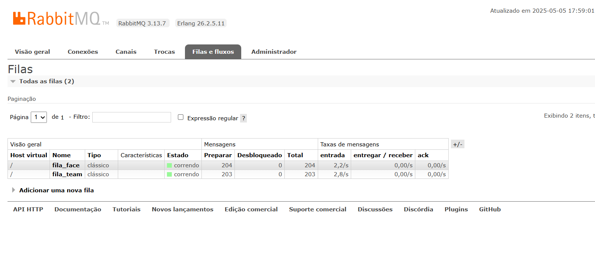
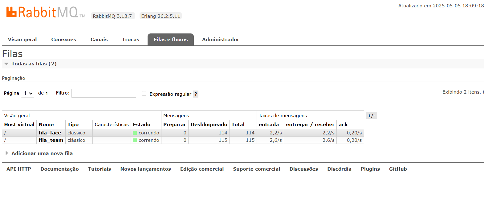

# Descrição do Projeto
Este projeto consiste em um sistema distribuído em containers utilizando RabbitMQ como broker de mensagens. O sistema é composto por 4 containers: um para o gerador de mensagens, dois para os consumidores com IA embutida, e um para o RabbitMQ. O sistema gera e processa mensagens de forma assíncrona, com o objetivo de simular uma carga de trabalho onde as mensagens são consumidas mais lentamente do que são geradas, levando ao crescimento visível das filas do RabbitMQ.

# Funcionalidades
  Gerador de Mensagens: Gera mensagens de tipos específicos (rosto de uma pessoa ou brasão de time de futebol) e as envia ao RabbitMQ.
  RabbitMQ: Broker de mensagens que armazena e encaminha as mensagens aos consumidores, de acordo com a chave de roteamento.
  Consumidor 1: Processa as mensagens relacionadas a rostos e realiza uma análise de sentimentos (feliz/triste).
  Consumidor 2: Processa as mensagens relacionadas a brasões de times de futebol e identifica o time correspondente.

  # Como executar o projeto 
Primeiramente, você precisa construir e iniciar os containers para todos os serviços. Abra o terminal e execute o seguinte comando na raiz do projeto, onde o arquivo `docker-compose.yml` está localizado:
```bash
docker-compose up --build
```
# Acessar o RabbitMQ
Após os containers estarem em execução, você pode acessar a interface de administração do RabbitMQ para monitorar as filas e visualizar a atividade das mensagens. Abra seu navegador e acesse o seguinte endereço:
```bash
http://localhost:15672
```
Quando uma mensagem é enviada a uma fila no RabbitMQ, ela pode estar em três estados principais:
Campo	Significado
Ready -	Mensagens que ainda não foram consumidas por nenhum consumidor.
Unacked -	Mensagens que foram entregues ao consumidor, mas ainda não foram confirmadas (acknowledged).
Total	Soma de Ready + Unacked. Representa o número total de mensagens na fila.

As mensagens foram entregues para os consumidores e estão sendo processadas nesse momento.
Nenhuma mensagem está “em espera” na fila, porque:
O consumidor conseguiu buscar rapidamente todas as mensagens disponíveis.
Mas como ele é lento (ex: time.sleep(4)), o processamento ainda não terminou.
Resultado: as mensagens estão na fase "desbloqueadas", ou seja, a fila entregou, mas o consumidor ainda não finalizou.

As mensagens se acumularam na fila e não foram buscadas ainda pelos consumidores.
Isso acontece quando:
O consumidor não está conseguindo acompanhar a produção.
Ou acabou de ser (re)iniciado e ainda não consumiu nenhuma.
